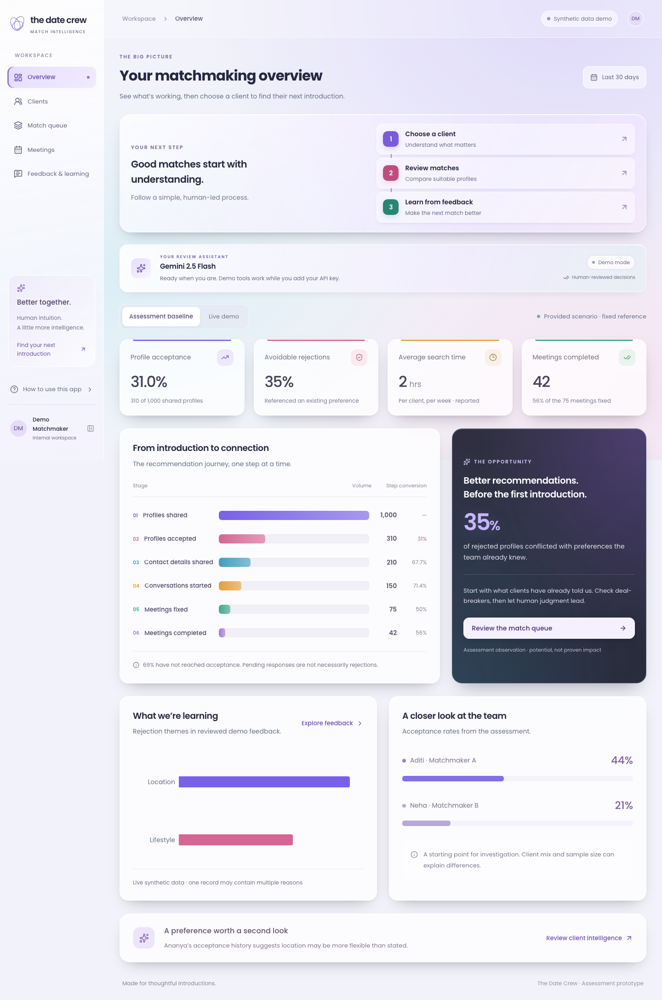
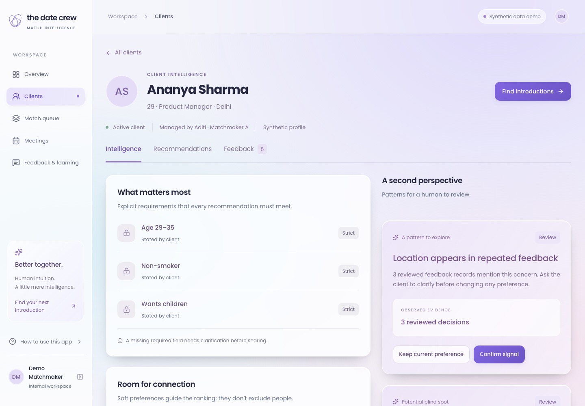
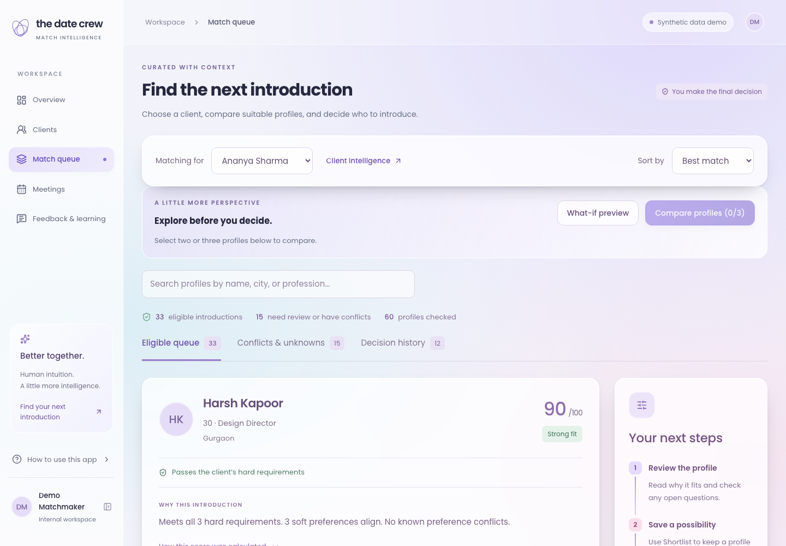
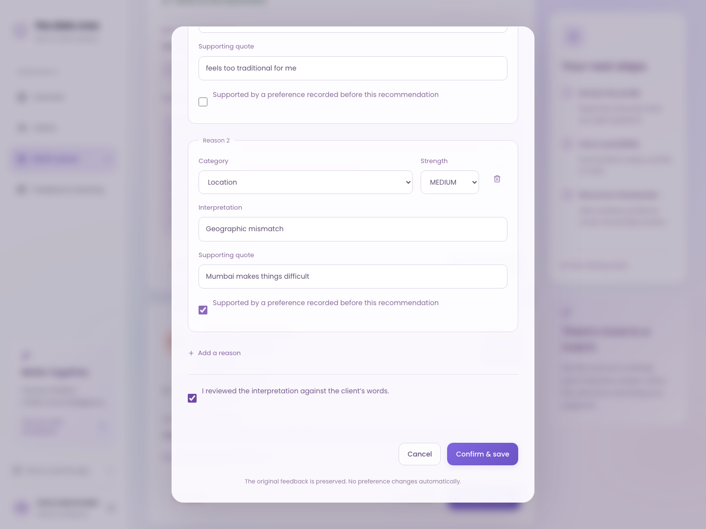

# TDC Match Intelligence

A human-reviewed matchmaking workspace: check deal-breakers, understand a ranking, record feedback, and review preference signals. Built for The Date Crew product assessment using synthetic data only.



## What works

- Five responsive views: overview, clients, client intelligence, match queue, feedback intelligence.
- Deterministic eligibility with three states: eligible, known conflict, missing required information.
- Transparent 45/25/20/10 ranking; unapplied signals cannot affect the score.
- Shortlist, mark shared, record acceptance, and progress to completed meetings.
- Feedback analysis, editable categories/evidence, manual fallback, explicit confirmation, and PostgreSQL persistence.
- Repeated-rejection and stated-versus-observed signals, generated from actual demo records.
- Confirming a signal does not change a preference. Applying location flexibility is a separate, explicit action.
- Live metrics calculated from milestone timestamps. Internal screening rejections do not count as client rejections.
- Separate fixed assessment baseline and live synthetic metrics; no fabricated growth percentages.

## Interface

The redesigned workspace uses locally bundled Poppins, larger body text, frosted glass panels, and layouts that reflow instead of shrinking the text on mobile. A three-step start guide points beginners to clients, matches, and feedback. Ranking details stay collapsed until requested. Feedback has separate entry and review steps.

## Stack

Next.js 16 App Router, React 19, JavaScript/JSX, Tailwind CSS 4 with custom component styles, Prisma 7, PostgreSQL, Gemini 2.5 Flash structured JSON output, Zod, Recharts, Lucide.

No application TypeScript, separate backend, training pipeline, or vector database. Prisma 7's connection configuration lives in `prisma.config.js` and the runtime uses `@prisma/adapter-pg`.

## Quick start — local demo

Requires Node.js 22.12+ (tested with 24.16) and npm. An embedded **real PostgreSQL** development server is included; Docker and a cloud database account are unnecessary for the local demo.

```bash
npm install
cp .env.example .env
npm run db:local
```

Keep the database terminal open. In another terminal:

```bash
npm run db:migrate
npm run db:seed
npm run dev
```

Open http://127.0.0.1:3000. The local database listens only on loopback port 54329 and persists in the ignored `.local-db/` directory. If initialization is interrupted before `PG_VERSION` exists, remove only that incomplete project-local directory before retrying. Do not delete an existing database.

### Already have PostgreSQL?

Set `DATABASE_URL` in `.env`, skip `db:local`, then run migrations and seed. **Use a dedicated demo database: the seed resets all records in this application's tables.** Migration and seed are explicit commands, never run automatically on a visitor request or a build.

## AI modes — no hidden simulation

| Mode        | Configuration                                 | Behavior                                                           |
| ----------- | --------------------------------------------- | ------------------------------------------------------------------ |
| Live Gemini | Set `GEMINI_API_KEY`; model fixed to `gemini-2.5-flash` | Structured extraction with schema and supporting-quote validation  |
| Demo rules  | No key and `DEMO_ANALYZER=true`               | Small deterministic example parser, visibly labeled **Demo rules** |
| Manual      | No key and `DEMO_ANALYZER=false`              | Editable manual categories; preserves original text                |

The checked-in example defaults to the labeled demo-rule mode. No live API key was available during development, so a real Gemini request has **not** been verified. A configured key takes precedence over the demo setting. Both AI features use `gemini-2.5-flash`, configured in `lib/gemini.js`. If a live request fails, the interface preserves the text and offers manual categorization instead of pretending the demo parser was AI.

API keys remain server-side. Requests use the Gemini REST API with server-side key headers, a 30-second timeout, schema validation, and no automatic retry. Names, contact details, and photos are not needed for the extraction request. The app does not send emails; **Mark shared** records an external sharing event.

## A three-minute reviewer journey

1. Open **Overview**. Switch between the supplied assessment baseline and **Live demo**.
2. Open **Clients → Ananya Sharma**. Inspect strict requirements and the location signal: three of the last five accepted profiles were outside Delhi NCR.
3. Open **Match queue**. Inspect a score breakdown and the **Conflicts & unknowns** tab.
4. In the eligible queue, search **Mumbai**. Choose an unshared profile and click **Mark shared**. Open **Decision history** and find that profile.
5. Click **Reject**, then **Use demo example → Analyze feedback**. Review the editable lifestyle/location categories and their evidence. The source label accurately identifies demo rules or Gemini.
6. Check the review confirmation and **Confirm & save**. Ananya now has three lifestyle feedback records and a new reviewable signal. Check **Feedback intelligence** and live analytics.
7. On Ananya's location signal, click **Confirm signal**. Observe that preferences remain unchanged. Only after checking client confirmation and clicking **Apply flexible location** does location weight change from 1 to 0.25.

Reset only this synthetic dataset with `npm run db:seed` before repeating the demo.

## Verification

```bash
npm test
npm run build
npm start
```

In another terminal, against a freshly seeded demo database:

```bash
npm run test:e2e
```

Install Chromium with `npx playwright install chromium` if needed. Browser tests intentionally mutate the synthetic database and must start from a fresh seed. They cover persistence, analysis without mutation, explicit preference application, blocked sharing, invalid transitions, malformed input, all five pages, and desktop/mobile overflow. Tests run against the production server on port 3000.

The build uses Next.js's supported Webpack option because the local sandbox prevented Turbopack's CSS worker from binding a temporary socket. This is a build-engine choice, not a change to the application architecture.

Two transitive dependency overrides address audit findings while preserving Prisma 7: `deepmerge-ts` and `mysql2`. The schema generator, migration, runtime, and production build were verified with these overrides.

## Deployment

See [DEPLOYMENT.md](docs/DEPLOYMENT.md) for Vercel + managed PostgreSQL. A public deployment and GitHub repository have not been provisioned in this workspace. The local preview is not a public submission URL.

No production authentication is included, as scoped in the brief. Public demos must contain synthetic data only. Keep Gemini disabled on an unrestricted public demo, or enable hosting access protection before configuring a paid key. The public demo database is shared among visitors; this is not a multi-tenant product.

## Submission materials

- [Written assessment](docs/ASSESSMENT.md)
- [PDF assessment](output/pdf/TDC-Assessment.pdf)
- [Demo narration and checklist](docs/DEMO.md)
- [Architecture and decisions](docs/ARCHITECTURE.md)
- [Screenshots](docs/screenshots)
- Original supplied specifications are preserved in `docs/specifications/`.





## Known MVP limits

No real-person data, authentication, email sync, bilateral preference database, scheduling integration, or search-time instrumentation. The displayed 2h search-time value is the assessment baseline; live demo search time correctly displays unavailable. Rankings use deliberately simple weights and are not calibrated probabilities. Signals use transparent thresholds, not statistical significance. No claimed conversion lift has been measured. The demo parser handles a narrow example set and must not be mistaken for a language model.

## Matchmaker tools (September 25 update)

- **Compare profiles:** select two or three cards in Match queue, then open Compare profiles. The table aligns facts, preferences, ranking scores, unknowns, and two-sided status. Selection resets when changing client.
- **What-if preview:** explore soft-preference importance without saving. Hard constraints remain locked. The entire active candidate pool is recalculated, with the top eight displayed; this includes profiles already in decision history. Preview scores are not compatibility probabilities.
- **Introduction drafts:** use Draft introduction on a client-eligible profile. Gemini structured output is used when `GEMINI_API_KEY` is set; otherwise a clearly labeled template is returned. Inspect the fact list and check the review box before copying. Editing resets review. No message is sent or introduction marked shared. Live API generation requires your key and has not been verified in this local environment. Reference: https://ai.google.dev/gemini-api/docs/generate-content/structured-output
- **Two-sided checks:** open the check on any candidate card. Record verified candidate requirements and separately verified client facts. Missing data is shown as incomplete; known reciprocal conflicts block shortlist/share and introduction drafts server-side. Aligned means only that the recorded requirements match, not that both people are interested. Candidate requirements apply across clients. Existing seed data deliberately does not invent reciprocal requirements.
- **Meeting coordination:** Meetings lists accepted introductions. Save availability notes, a scheduled time and duration, location, status, and follow-up date. Scheduling requires participant confirmation; conflicting bookings and stale edits are rejected. Search, status filters and progressive loading keep the view manageable. Times are entered/displayed in the device timezone and stored as UTC. Meetings are internal plans with no automatic messages or calendar synchronization. Their statuses are separate from the historical introduction milestones on the dashboard; update those milestones in Match queue after confirming the event occurred.

Apply the additive migration with `npm run db:migrate`; existing demo records are preserved. The new `Client.facts` and `CandidateProfile.partnerRequirements` JSON fields remain empty until reviewed, and `Meeting` stores versioned coordination plans. The application remains a synthetic-data assessment prototype; the existing deployment/authentication limitations still apply.

Focused verification: `npm test` and `npx playwright test tests/e2e/match-tools.spec.js`. The latter creates and removes its own temporary records, exercises all five tools and checks API guards. Existing `workflow.spec.js` mutation tests still require their documented seeded state.


## Enable Gemini 2.5 Flash

1. Create an API key in [Google AI Studio](https://aistudio.google.com/apikey).
2. In the project `.env`, set `GEMINI_API_KEY="your-key"`. Keep it server-only (never use a `NEXT_PUBLIC_` prefix). The placeholder has already been added locally.
3. Restart the server (`npm start` after a production build, or `npm run dev`). No schema migration is needed for this provider change.
4. The overview and feedback pages show **Key configured**. This indicates configuration, not a verified connection. Run a feedback analysis or introduction draft to verify your account can use the model; successful drafts explicitly say **Gemini 2.5 Flash**.

A configured Gemini key takes precedence over `DEMO_ANALYZER`. Without a key, feedback can use labeled demo rules or manual review and introductions use a labeled template. Old OpenAI environment variables are no longer used; old saved feedback records retain their historical source labels.

Google currently lists free input/output for this model's standard free tier. Free usage depends on your project's eligibility, quotas and billing tier; the app cannot force a billed project onto a free tier. No grounding/search tools or automatic retry loops are used. A 429 shows an explicit quota message. Google's pricing page marks free-tier data as used to improve its products, so use the synthetic assessment records for the demo. Check [pricing](https://ai.google.dev/gemini-api/docs/pricing) and your AI Studio limits before use.

Gemini integration tests use mocked provider responses: successful parsing, quota/authentication failures, network failures, blocked/truncated/malformed responses, evidence validation and saving the GEMINI source. Live generation remains unverified until a valid key is configured.

## Matchmaker assistant

Open `/assistant` or the AI assistant sidebar item. Four guided tasks produce client briefs, unintroduced candidate suggestions, missing-data checks, and feedback summaries. Gemini 2.5 Flash supports free-form questions when configured. Each turn reloads client-scoped facts and returns inspectable evidence plus links into the existing tools. The assistant is read-only: it cannot silently change preferences or send introductions. Candidate IDs and evidence references are validated server-side; AI wording still needs human review. No key is required for explicitly labeled guided summaries.

The assistant considers a bounded context: the first eight available ranked profiles, named profile lookups, a few blocked examples, eight recent feedback records and five signals. Conversation state is temporary and clears on client changes. For research, feature proposals and a pilot plan, see `docs/ASSISTANT_AND_NEW_IDEAS.md`.

### Live Gemini verification update

A configured key was available during assistant verification. Real Gemini 2.5 Flash structured generation and a client-scoped assistant answer succeeded on synthetic data after correcting the adapter to use `responseMimeType` and `responseJsonSchema`. A transient provider failure was also observed; retry/guided recovery remains available. Earlier notes saying no live key was available describe prior development phases; they do not negate this later verification. Feedback and introduction semantics still require human review.
